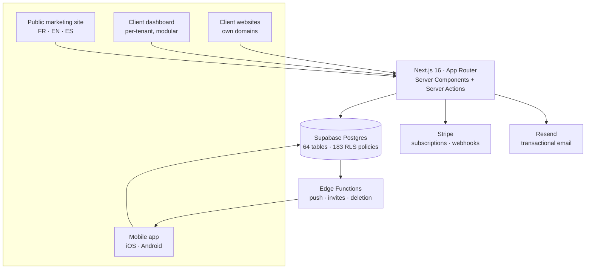

# RLCore

**A multi-tenant SaaS platform for small businesses — web dashboard, public sites, and a native mobile app on a single Postgres backend.**

Live at **[rlcore.fr](https://www.rlcore.fr)**. Built and operated solo.

> **This is a case study, not the source.** RLCore is a commercial product and its code
> is private. This repository documents the architecture and the engineering decisions
> behind it — the part that is actually worth reading.

---

## The problem

A small business — a café, a clinic, an artisan — needs a website, a booking system,
invoicing, a customer list. The market gives them two options: a €30/month website
builder that does one thing, or a €10k custom build they cannot afford.

RLCore is the third option: each client gets a public website **and** a back-office,
both provisioned from one codebase, with only the modules they need switched on.
Pricing starts at €49/month.

---

## At a glance

| | |
|---|---|
| **Platform** | Next.js 16 (App Router, RSC) · React 19 · TypeScript · Tailwind 4 |
| **Mobile** | Expo SDK 57 · React Native 0.86 · Expo Router · EAS Update (OTA) |
| **Backend** | Supabase (Postgres, Auth, Storage, Edge Functions) |
| **Billing** | Stripe (subscriptions, multi-currency, webhooks) |
| **Web codebase** | 551 files · ~97k lines TS/TSX · 67 pages · 59 route handlers |
| **Mobile codebase** | 182 files · ~38k lines TS/TSX · 73 screens |
| **Database** | 111 migrations · ~10k lines SQL · 64 tables · 183 RLS policies |
| **Languages** | French, English, Spanish — UI *and* content |
| **Modules** | Analytics, CRM, Invoicing, Orders, Catalog, Shipping, Projects, Bookings, Blog |

---

## Architecture

Everything a tenant can see is decided **in the database**, not in application code.
The web app and the mobile app talk to the same Postgres with the same policies — there
is no backend-for-frontend, and no second implementation of the authorization rules.

---

## Engineering decisions

The interesting part of a project is rarely the stack. It is what you chose *not* to do.

### 1. Tenant isolation in Postgres, not in the application

**Context.** Multi-tenant SaaS: every query must be scoped to one organization, and a
leak between tenants is the one bug you genuinely cannot ship.

**Decision.** Row Level Security on every table — 183 policies. Membership lives in
`organization_members`; policies derive access from it. Application code never writes
`where organization_id = ...` as a security measure.

**Trade-off.** Policies are harder to test than a query helper, and a missing `USING`
clause fails closed in confusing ways. In exchange, a forgotten filter in a React Server
Component is a bug, not a breach — and the mobile app inherits the same guarantees for
free, without reimplementing a single rule.

### 2. One codebase, modules toggled per organization

**Context.** A café needs bookings and a catalog. A consultancy needs invoicing and
projects. Neither should see the other's navigation.

**Decision.** A typed module registry (`analytics`, `crm`, `invoices`, `orders`,
`catalog`, `shipping`, `projects`, `reservations`, `blog`) declares routes, nav items,
dashboard widgets and default state. A per-organization row decides what is on; a route
guard enforces it.

**Trade-off.** Every new feature has to declare where it belongs, which is friction on
day one. It buys the ability to onboard a new vertical by flipping flags rather than
forking the product.

### 3. Cookieless analytics with a rotating daily salt

**Context.** Clients want visitor statistics. I did not want to put a cookie banner on
every client site, or ship their visitors' data to a third party.

**Decision.** A visitor identifier is `sha256(daily_salt | ip | user-agent | site_id)`.
The salt is generated per day, readable only by `service_role`, and **destroyed after
48 hours** — that destruction is what makes yesterday's identifiers permanently
unlinkable to today's. No cookie, no cross-site identifier, no third party.

**Trade-off.** No returning-visitor metric beyond 24h, and no cross-device attribution.
Worth it: GDPR-clean by construction, no banner, and the data never leaves the client's
own database.

### 4. Client websites: database-backed with a static fallback

**Context.** Client sites are edited from the dashboard, so their content is in Postgres.
But a marketing site that 500s because the database hiccups is unacceptable.

**Decision.** Every content block resolves from the database, falling back to a static
version committed alongside the site. Publishing from the dashboard triggers a targeted
revalidation through a signed per-organization token rather than a blanket purge.

**Trade-off.** Two sources of truth to keep aligned. In return, the site is always up,
always fast, and an editor sees their change live in seconds instead of waiting on a
rebuild.

### 5. One price per plan, two currencies

**Context.** Selling in euros domestically and dollars internationally usually means
duplicating the entire product catalog in Stripe, then keeping both in sync forever.

**Decision.** A single Stripe price per plan using `currency_options`, with a market
resolved at checkout. Two scripts — `sync-prices` and `check-prices` — reconcile the
live catalog against the source of truth and fail loudly on drift.

**Trade-off.** `currency_options` is less discoverable than parallel price objects and
the API surface is fiddlier. It removes an entire category of "customer charged in the
wrong currency" incidents.

### 6. Shared backend between web and mobile

**Context.** The mobile app needs the same data, the same auth, the same permissions.

**Decision.** Expo talks directly to Supabase — same tables, same RLS, same session.
No API layer in between. Native push runs through an Edge Function so the service key
never reaches the device, and JS ships over the air with EAS Update.

**Trade-off.** The client is coupled to the schema, so a migration can break a released
build — mitigated by additive-only migrations and OTA updates. It saved building and
maintaining an entire API tier for a two-surface product.

### 7. Production observability, built rather than bought

**Context.** Errors in a Next.js app on Vercel arrive as minified stack traces from a
Turbopack bundle. With real clients on the platform, "it crashed somewhere" is not
actionable.

**Decision.** An error journal writing to Postgres, with occurrence counting so one bad
deploy is a single entry with a counter rather than 400 rows, source-map resolution
against the deployed bundle, and a plain-French explanation layer that turns a runtime
error into a sentence I can act on at 11pm.

**Trade-off.** Real maintenance cost, and it does less than Sentry. It lives inside the
same dashboard, on the same data, with no per-event pricing — and I understand every
line of it.

---

## What I would do differently

- **Test the RLS policies directly.** They are the security boundary and they are
  verified mostly by using the product. A policy-level test suite should have come
  before the feature count got interesting.
- **Split the marketing site from the dashboard sooner.** They share a deploy, so a
  dashboard change rebuilds the public site. It has not hurt yet; it will.
- **Commit to one charting library.** Bundle analysis caught the same library pulled in
  three ways — a measurable cost that a five-minute decision at the start would have
  avoided.

---

## Documentation

- [Architecture](docs/architecture.md) — data model, tenancy, request flow
- [Design system](docs/design-system.md) — tokens, motifs, the visual language

---

## Contact

**Raphaël Laupies** — [rlcore.fr](https://www.rlcore.fr) · [GitHub](https://github.com/raphlp)

Happy to walk through any part of this in detail, including the code, in an interview.
