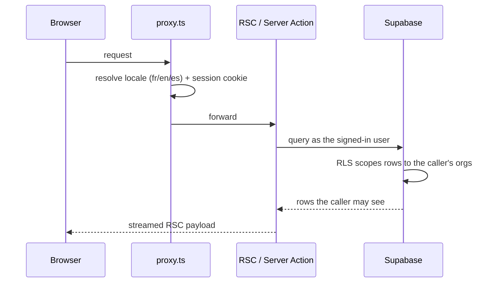

# Architecture

How RLCore is put together, at the level of detail I would use to onboard another
engineer. Source code is private; this describes the shape, not the implementation.

---

## The tenancy model

Everything hangs off `organizations`. A user belongs to zero or more organizations
through `organization_members`, which also carries their role. A platform super-admin is
a separate flag, not an organization role.

```
profiles ──< organization_members >── organizations
                                          │
                     ┌────────────────────┼────────────────────┐
                     │                    │                    │
               site_pages           contacts / deals      invoices / orders
               site_blocks          crm_tasks             invoice_lines
               organization_        contact_messages      order_items
               site_tokens                                order_status_history
```

64 tables in total, grouped into:

| Group | Tables |
|---|---|
| **Tenancy & identity** | `organizations`, `organization_members`, `profiles`, `invitations` |
| **Client sites** | `site_pages`, `site_blocks`, `organization_site_tokens` |
| **CRM** | `contacts`, `deals`, `crm_tasks`, `contact_activities`, `contact_messages` |
| **Commerce** | `products`, `categories`, `product_types`, `orders`, `order_items`, `shipping_zones`, `shipping_methods` |
| **Invoicing** | `invoices`, `invoice_lines`, `platform_invoices` |
| **Bookings & projects** | `reservations`, `projects`, `project_tasks`, `project_milestones` |
| **Analytics** | `analytics_events`, `analytics_sessions`, `analytics_daily_stats`, `analytics_page_stats`, `analytics_goals`, `analytics_conversions`, `analytics_daily_salts` |
| **Billing & platform** | `stripe_events`, `platform_settings`, `platform_usage_events` |
| **Observability** | `error_events`, `perf_events`, `audit_events`, `audit_requests` |
| **Growth** | `prospects`, `prospection_runs`, `prospect_outbox`, `instagram_*` |
| **Notifications** | `notifications`, `device_tokens`, `push_config` |

### Row Level Security

Every table has RLS enabled — 183 policies. The shape is consistent:

- **Read** — the row's `organization_id` must be one the caller is a member of.
- **Write** — same, plus a role check where the operation is privileged.
- **Platform tables** — `service_role` only, no policy at all. `analytics_daily_salts`
  is the clearest example: if the salt leaked, a known IP's identifier could be
  recomputed for that day, so nothing but the service role can read it.

Policies are the authorization layer. Application code is not trusted to scope queries,
which is what lets the mobile app hit Postgres directly without duplicating a single
rule.

---

## Request flow (web)



Mutations go through Server Actions, validated with Zod at the boundary, then wrapped in
a shared runner that normalizes errors, writes the audit trail, and returns a typed
result the client can render without a second round trip.

---

## Client websites

A client site is data, not a fork.

1. Content lives in `site_pages` and `site_blocks`, edited from the dashboard.
2. Each block resolves from the database, with a **static fallback** committed with the
   site — a database hiccup degrades to the last known-good content rather than a 500.
3. Publishing calls a revalidation endpoint authenticated by a per-organization token
   from `organization_site_tokens`, so a tenant can only ever purge its own paths.

---

## Mobile

Expo Router, file-based, with three protected route groups:

```
src/app/
  (auth)/     login, signup, password reset, marketing screens
  (app)/      tenant dashboard — 9 modules, settings, notifications
  (admin)/    platform admin — organizations, revenue, prospection, errors, audit
```

`Stack.Protected` gates each group on session, organization membership and admin status.
The app reads Supabase directly; the only server-side pieces are four Edge Functions
(`send-push`, `invite-member`, `delete-account`, `web-login-link`) that need the service
key. JavaScript ships over the air with EAS Update, so a fix reaches users without a
store review.

---

## Internationalization

Three languages — French, English, Spanish — across the whole surface:

- Routes are locale-prefixed and negotiated at the proxy.
- UI strings live in `messages/{fr,en,es}.json` via `next-intl`.
- **Content is translated too**, not just chrome: module names, marketing pages, blog
  posts and transactional emails all carry per-locale variants in the database.

---

## Observability

| Signal | Where | Notes |
|---|---|---|
| Errors | `error_events` | Occurrence counting, source-map resolution against the deployed Turbopack bundle, plain-language explanation layer |
| Performance | `perf_events`, `perf_metrics` | Field metrics from real sessions, plus a subjective "felt slow" channel |
| Audit | `audit_events` | Who did what, in which organization |
| Analytics | `analytics_*` | Cookieless, rotating daily salt destroyed after 48h |

All of it is queryable from the same dashboard, against the same database, with no
per-event pricing.
