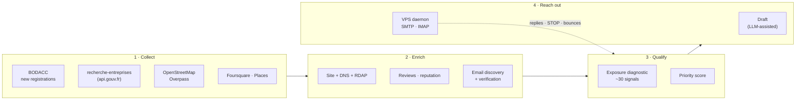

# The growth engine

The part of RLCore that finds its own customers.

A platform priced at €49/month cannot afford paid acquisition or a sales team. So
acquisition is a system: it collects public business records, works out which of those
businesses have a web presence problem, and contacts the ones worth contacting — under
constraints strict enough that it can run unattended.

**~9,500 lines**, 19 external data sources, 12 scheduled jobs, one daemon on a VPS.

---

## Pipeline



### 1 · Collect

Public sources only. BODACC for newly registered businesses, the French company registry
API for firmographics, the address and geo APIs for normalization, OpenStreetMap
(Overpass, three mirrors with failover) and Places data for the ones that never
registered a website anywhere.

### 2 · Enrich

For each candidate: does a site exist, does it serve HTTPS, is the certificate valid,
what does DNS say, who holds the domain (RDAP), is the domain even taken. Reviews and
ratings where available. Then email discovery, and **verification before any send** —
a third-party verifier on a metered free tier, with `unknown` treated as unknown rather
than quietly promoted to valid.

### 3 · Qualify

A diagnostic scores roughly thirty observable signals — no site at all, no HTTPS,
expired certificate, missing DMARC, `noindex`, not responsive, no legal notices, no
privacy policy, no Google listing, no booking or quote path, platform-commission
dependency, and so on — into a prioritized, *explainable* verdict. The output is not a
number; it is a list of specific, verifiable problems.

> **The red line: everything is observed passively.** The diagnostic reads what a
> business publishes to the world. It never probes paths, never scans for
> vulnerabilities, never touches anything that is not already public. That constraint is
> written into the module, not just into my intentions.

### 4 · Reach out

Drafts are generated from the diagnostic — the email says what is actually wrong with
*that* business — and LLM-assisted for phrasing. Sending is delegated to a daemon
described below.

---

## The design decision worth reading

**The sending daemon holds no database credentials.**

It runs on a VPS under systemd (`Restart=always`, survives crashes and reboots). It
holds exactly two things: a dedicated secret for talking to the site, and the mailbox
credentials. That is all.

Every decision — is the sending window open, what is today's cap, who is on the opt-out
list, is deliverability healthy — is made **site-side**, by the only component holding
the database key. The daemon's loop is deliberately dumb:

```
ask the site "what should I do?"
  → sleep, or
  → send ONE email over SMTP, report the result
     then wait 3–15 random minutes
every 15 min: poll IMAP, hand replies and STOPs back to the site
```

If the VPS is compromised, the attacker gets a mailbox and an API secret scoped to three
endpoints. They do not get the prospect database, the customer database, or anything
else. Least privilege enforced by topology rather than by configuration.

---

## Guardrails

Automated outreach that ignores its own signals is how a domain gets burned. The
protections run above everything else, including manual overrides.

**Warm-up ramp** — a new mailbox sends 5/day for the first week, 10 in the second, 20 in
the third, then the configured quota. A manual boost exists for deliberate pushes and is
hard-capped at 50.

**Health verdict** — `ok`, `reduced`, or `paused`, recomputed continuously:

| Signal | Threshold | Effect |
|---|---|---|
| Dead addresses | ≥2 bounces, ≥10 attempts, ≥5% confirmed floor | reduce |
| STOP rate | >8% over 30 days | flag — templates or targeting are wrong |
| Gmail Postmaster reputation | `BAD`, or spam ≥0.3% | **pause** |
| Gmail Postmaster reputation | `LOW`, or spam ≥0.1% | reduce |

Two details that took a production incident to get right:

- **A bounce rate never pauses sending on its own.** It is a list-hygiene problem, not a
  reputation problem. Conflating the two pauses a healthy campaign over three dead
  addresses.
- **The measured floor is used, not the raw rate.** With few attempts, a bounce rate is
  noise — "somewhere between 4% and 40%" is not a number you should act on. Below 10
  attempts, no verdict is issued at all.

**Opt-out is absolute.** STOP replies and bounces write to a dedicated table checked
before every send, and a separate do-not-contact list is honoured permanently. Replies
are collected over IMAP and handed back to the site every 15 minutes.

---

## Operations

Twelve scheduled jobs run the engine: registry sync, enrichment batches, diagnostics,
draft generation, email verification, follow-ups, insights, daily summary. A separate
repository (`rlcore-ops`) handles VPS orchestration and monitoring.

Everything is observable from inside the product — the admin dashboard has prospection
pipeline, send log and outbox views, on web and on mobile. The same error journal and
audit trail that cover the platform cover the growth engine, because it is not a
side-project bolted on; it is a module of the same application.

---

## What this demonstrates

Bluntly, because that is the point of this document: ingesting and reconciling
nineteen unreliable external sources, designing a privilege boundary between a public
VPS and a production database, and encoding compliance and deliverability rules as
enforced invariants rather than good intentions. Built solo, running unattended.
